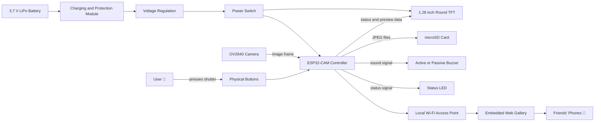
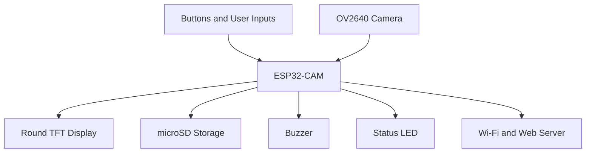
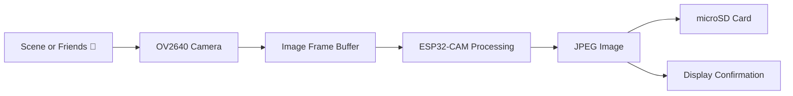
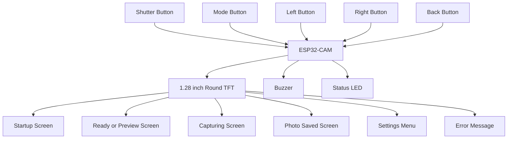
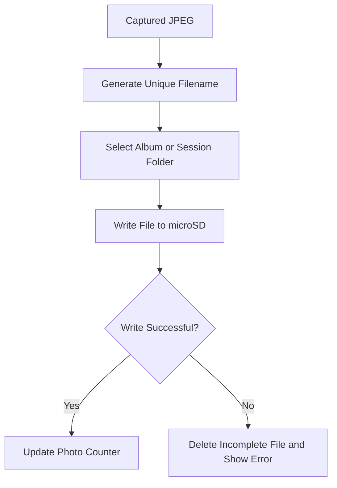
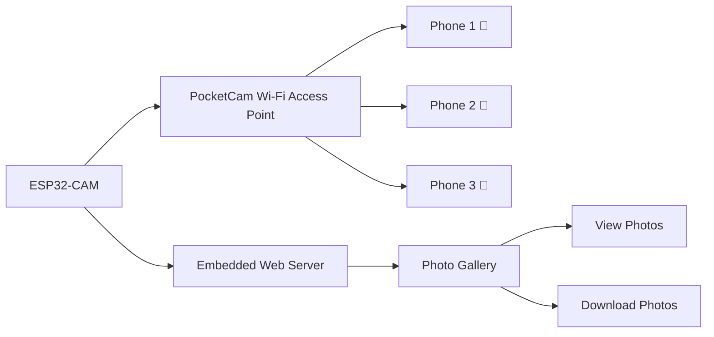
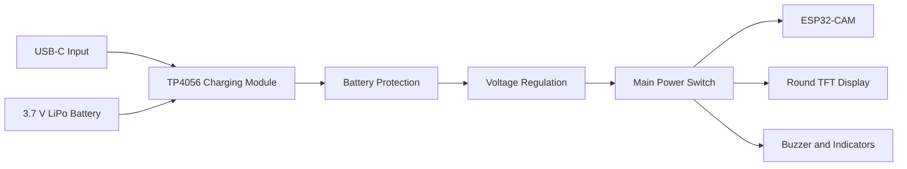
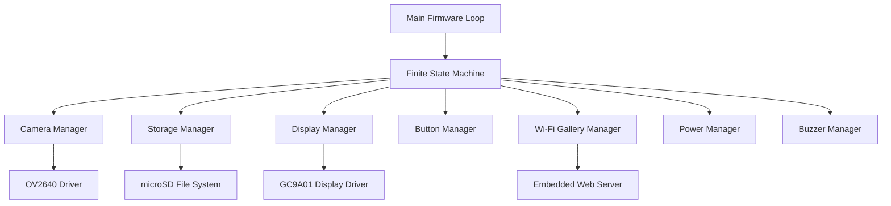
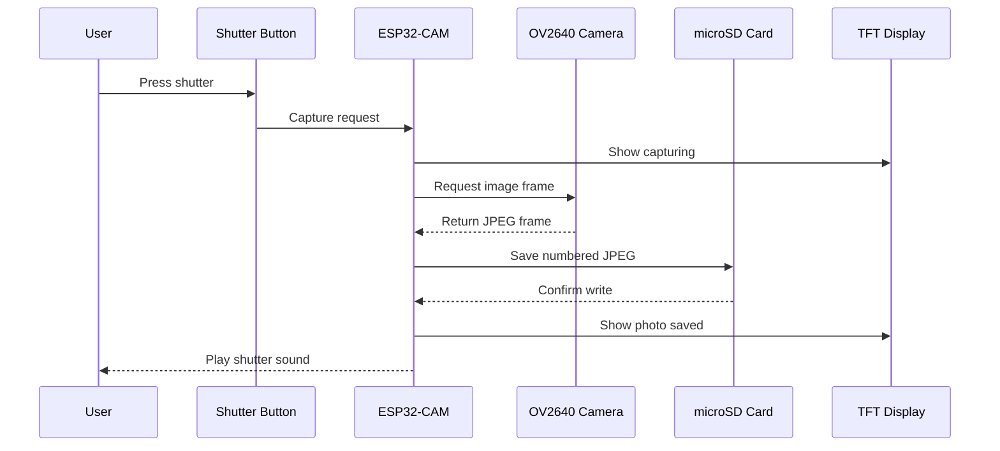

# ✦ PocketCam System Architecture 📷🐻

PocketCam is divided into five main subsystems:

- image capture
- user interface
- storage
- wireless sharing
- portable power

## Overall System Architecture



---

## ✦ Main Controller Subsystem

The ESP32-CAM acts as the central controller of PocketCam.

It is responsible for:

- controlling the OV2640 camera
- processing shutter button input
- capturing JPEG images
- generating unique filenames
- saving photographs to the microSD card
- updating the round TFT display
- controlling the buzzer and status indicators
- creating the local Wi-Fi network
- hosting the offline web gallery



---

## ✦ Image Capture Architecture



The full rectangular JPEG image is stored on the microSD card.

The round display may show:

- a cropped preview
- a reduced preview
- capture status
- the most recent photo
- photo number and camera settings

---

## ✦ Display and User Interface Architecture



### Planned user interface screens

```text
╭────────────────────╮
│    POCKETCAM 📷    │
│    starting...     │
╰────────────────────╯
```

```text
╭────────────────────╮
│                    │
│    LIVE PREVIEW    │
│                    │
│  AUTO     IMG 024  │
╰────────────────────╯
```

```text
╭────────────────────╮
│   PHOTO SAVED ✦    │
│                    │
│   IMG_0025.JPG     │
╰────────────────────╯
```

---

## ✦ Storage Architecture



### Planned storage structure

```text
microSD/
│
├── photos/
│   ├── IMG_0001.JPG
│   ├── IMG_0002.JPG
│   └── IMG_0003.JPG
│
├── albums/
│   ├── outing_001/
│   └── outing_002/
│
└── system/
    └── photo_counter.txt
```

Session albums are a planned additional feature. The first version may store all photographs inside one folder.

---

## ✦ Offline Wireless Sharing Architecture



PocketCam will host its own Wi-Fi network.

Example network:

```text
Wi-Fi name: PocketCam
Internet: Not required
Gallery address: local PocketCam webpage
```

Users will be able to:

- connect directly to PocketCam
- open the local web gallery
- view saved photographs
- download selected photographs
- use the system without mobile data or cloud services

---

## ✦ Power Architecture



The final power path will only be confirmed after measuring the actual current requirements of:

- camera capture
- round TFT display
- Wi-Fi operation
- microSD writing
- buzzer and flash operation

The first prototype will be powered through the ESP32-CAM USB base.

---

## ✦ Software Architecture



### Planned firmware modules

```text
firmware/
│
├── PocketCam.ino
├── camera_manager
├── display_manager
├── storage_manager
├── button_manager
├── wifi_gallery
├── buzzer_manager
├── power_manager
└── pin_config
```

---

## ✦ Data Flow Summary



---

## ✦ Architecture Constraints

The design must account for:

- limited available GPIO pins on the ESP32-CAM
- camera and microSD pin usage
- memory required for camera frame buffers
- display bandwidth and preview frame rate
- power spikes during Wi-Fi and image capture
- microSD write speed
- limited battery capacity
- possible conflicts between display, camera and storage interfaces

The exact pin map will only be finalised after the round display and ESP32-CAM are physically tested.

---

## ✦ Current Architecture Status

```text
╭────────────────────────────╮
│                            │
│     POCKETCAM SYSTEM       │
│       ARCHITECTURE         │
│                            │
│      planned ✦ 🐻         │
│                            │
╰────────────────────────────╯
```

Current stage:

- system concept completed
- major subsystems identified
- components ordered
- GPIO mapping pending
- power system pending validation
- physical integration pending
