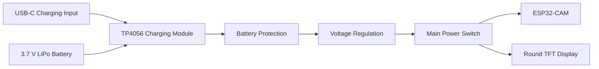
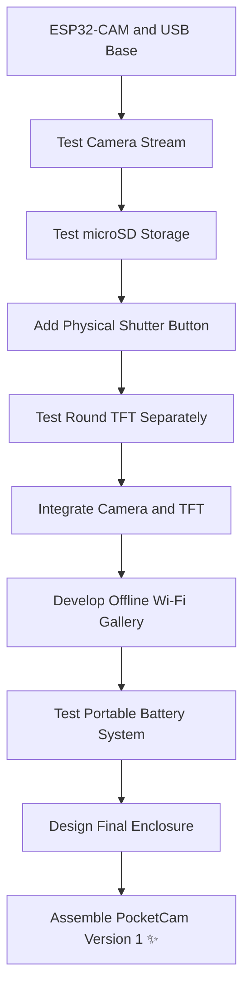

# ✦ PocketCam Hardware Component List 📷🐻

This document records the hardware components purchased and planned for the PocketCam prototype.

PocketCam is a portable ESP32-based digital camera designed to capture JPEG photographs, save them locally to a microSD card, provide a compact colour display and support offline wireless photo sha[...]

> **Hardware status:** Components ordered and awaiting delivery 📦🐰

---

## ✦ 1. Main Camera System 📷

| Component | Quantity | Status | Purpose |
|---|---:|---|---|
| ESP32-CAM development board | 1 | 📦 Ordered | Main microcontroller, camera processing, Wi-Fi communication and embedded web server |
| OV2640 camera module | 1 | 📦 Included | Captures photographs and provides image data to the ESP32-CAM |
| ESP32-CAM USB programmer base | 1 | 📦 Ordered | Allows firmware uploading, serial debugging and USB-powered development |
| Micro-USB data cable | 1 | 📦 Ordered | Connects the USB programmer base to a computer |

### ESP32-CAM responsibilities

The ESP32-CAM will be responsible for:

- receiving input from the shutter button
- capturing JPEG photographs
- generating unique image filenames
- saving photographs to the microSD card
- controlling the round TFT display
- creating the PocketCam Wi-Fi network
- hosting the offline photo gallery
- managing camera operating modes

> ⚠️ The exact ESP32-CAM model and available GPIO pins will be confirmed after the board arrives.

---

## ✦ 2. Camera Display 🌙

| Component | Quantity | Status | Purpose |
|---|---:|---|---|
| 1.28-inch round TFT LCD | 1 | 📦 Ordered | Displays the PocketCam interface, camera status, photo counter and possible image preview |
| Display controller | 1 | 🔍 To verify | Controls communication between the ESP32-CAM and TFT |
| Header pins | As required | 🔍 To inspect | Provides electrical connections to the display |
| Jumper wires | As required | 📦 Included in starter kit | Connects the display during prototyping |

### Expected display specifications

The purchased display is expected to have:

- 1.28-inch circular display
- 240 × 240 pixel resolution
- colour TFT LCD
- SPI communication
- 3.3 V-compatible logic
- GC9A01 or GC9A01A display controller

The exact controller and pin labels must be checked after delivery.

### Planned display information

The display may show:

- ✦ PocketCam startup animation
- 📷 camera-ready status
- 🖼️ live or reduced camera preview
- 💾 microSD status
- 🔢 photograph counter
- 🔋 battery level
- ⏳ self-timer countdown
- 📡 Wi-Fi gallery status
- ⚠️ camera and storage errors
- ✨ photo-saved confirmation

> The feasibility and frame rate of a live preview must be tested because the ESP32-CAM has limited memory, processing resources and available GPIO pins.

---

## ✦ 3. Photo Storage 💾

| Component | Quantity | Status | Purpose |
|---|---:|---|---|
| SanDisk 16 GB microSD card | 1 | 📦 Ordered | Stores JPEG photographs and future event or settings files |
| ESP32-CAM built-in microSD slot | 1 | 📦 Included | Provides the main storage interface |
| External microSD module | 1 | 📦 Purchased | Spare module and not currently required for the MVP |

### Planned storage format

The microSD card will initially use:

```text
microSD/
│
└── photos/
    ├── IMG_0001.JPG
    ├── IMG_0002.JPG
    ├── IMG_0003.JPG
    └── IMG_0004.JPG
```

Future versions may include session-based albums:

```text
microSD/
│
├── outing_001/
│   ├── IMG_0001.JPG
│   └── IMG_0002.JPG
│
└── outing_002/
    ├── IMG_0001.JPG
    └── IMG_0002.JPG
```

The microSD card will be formatted as FAT32 before testing.

---

## ✦ 4. Physical Camera Controls 🐾

| Component | Quantity | Status | Purpose |
|---|---:|---|---|
| Momentary push button | 1 | 📦 Included in starter kit | Main physical shutter button |
| Additional push buttons | Several | 📦 Included in starter kit | Menu navigation and camera-mode controls |
| Main power switch | 1 | 🔍 To confirm | Turns the portable camera system on and off |
| Button resistors | As required | 📦 Included in starter kit | Provides stable button input where internal pull-up resistors are unsuitable |
| Button caps | Optional | 🌱 Future | Improves comfort and appearance |

### Planned controls

```text
TOP OF CAMERA

╭────────────────────────╮
│ [ POWER ]    [SHUTTER] │
╰────────────────────────╯
```

```text
BACK OF CAMERA

╭────────────────────────╮
│                        │
│     ROUND DISPLAY      │
│                        │
│     [◀] [OK] [▶]       │
│                        │
╰────────────────────────╯
```

The number of physical buttons may be reduced if the available GPIO pins are insufficient.

---

## ✦ 5. Audio and Status Feedback 🔔✨

| Component | Quantity | Status | Purpose |
|---|---:|---|---|
| Active buzzer | 1 | 📦 Purchased | Produces a simple shutter or confirmation sound |
| Passive buzzer | 1 | 📦 Purchased | Produces custom tones and self-timer sounds |
| LEDs | Several | 📦 Included in starter kit | Indicates ready, capture, saving and error states |
| 220 Ω or 330 Ω resistors | As required | 📦 Included in starter kit | Limits current through external LEDs |

### Planned feedback

| Camera condition | Planned feedback |
|---|---|
| Starting | Startup screen or short tone |
| Ready | Ready icon on the TFT |
| Capturing | Capture animation |
| Saving | Saving indicator |
| Photo saved | Confirmation screen and shutter sound |
| Self-timer | Countdown display and short beeps |
| Error | Error message and warning indicator |
| Gallery active | Wi-Fi icon on the display |

Only one buzzer type will be used in the final camera.

---

## ✦ 6. Portable Power System 🔋

| Component | Quantity | Status | Purpose |
|---|---:|---|---|
| 3.7 V 1000 mAh LiPo battery | 1 | 📦 Purchased | Provides portable camera power |
| USB-C TP4056 charging module | 1 | 📦 Purchased | Charges the single-cell LiPo battery |
| Battery-protection circuit | To verify | 🔍 Pending inspection | Protects against unsafe battery conditions |
| Voltage-regulation module | To be determined | ⏳ Not selected | Provides a suitable and stable voltage to the camera system |
| Main power switch | 1 | ⏳ To confirm | Disconnects the camera system from the battery |
| Battery connector | 1 | 📦 Included with battery | Connects the LiPo battery to the power system |

### Planned power architecture



> ⚠️ The battery must not be connected to the ESP32-CAM until the charging module, battery polarity and required voltage regulation have been verified.

The first camera tests will use USB power through the ESP32-CAM programmer base.

---

## ✦ 7. Prototyping Components 🧪🐻

| Component | Quantity | Status | Purpose |
|---|---:|---|---|
| Breadboard | Included | 📦 Purchased | Temporary circuit assembly |
| Male-to-male jumper wires | Included | 📦 Purchased | Breadboard connections |
| Male-to-female jumper wires | Included | 📦 Purchased | Module-to-board connections |
| Female-to-female jumper wires | Included | 📦 Purchased | Connections between modules with male headers |
| Resistor assortment | Included | 📦 Purchased | Button, LED and sensor circuits |
| LED assortment | Included | 📦 Purchased | Status indication and testing |
| Pin headers | To inspect | 🔍 Pending | Connections for modules without soldered pins |
| USB cable | To confirm | 🔍 Pending | Programming and power |

The breadboard will only be used during development. The final portable camera will use a soldered board or another secure connection method.

---

## ✦ 8. Additional Purchased Components 🌷

These components are not required for the PocketCam MVP but may support future features.

| Component | Quantity | Possible Future Feature |
|---|---:|---|
| Microphone sound-sensor module | 1 | Clap-triggered group photographs |
| Light-dependent resistors | Several | Ambient-light measurement or low-light warning |
| External microSD module | 1 | Storage experiments or another embedded project |
| Passive buzzer | 1 | Custom melodies and timer sounds |
| Additional sensors from starter kit | Various | Future experiments |

These components will not be integrated until the core camera is reliable.

---

## ✦ 9. Enclosure Components 🏠🐰

| Component | Quantity | Status | Purpose |
|---|---:|---|---|
| Custom front camera shell | 1 | 🌱 Planned | Holds the camera board and provides lens access |
| Custom rear camera shell | 1 | 🌱 Planned | Holds the round display and controls |
| Small enclosure screws | 4–6 | ⏳ Not purchased | Secures the enclosure |
| Internal mounting supports | As required | 🌱 To design | Holds boards securely |
| Display protection cover | 1 | 🌱 Optional | Protects the round TFT |
| Wrist strap | 1 | 🌱 Future | Reduces the risk of dropping the camera |
| Shutter-button cap | 1 | 🌱 Future | Improves usability |

The enclosure will only be finalised after all electronic components are measured and tested.

---

## ✦ 10. Current Hardware Inventory 📦

### Purchased or ordered

- [x] 📷 ESP32-CAM
- [x] 🔌 ESP32-CAM USB programmer base
- [x] 📷 OV2640 camera module
- [x] 🌙 1.28-inch round TFT LCD
- [x] 💾 SanDisk 16 GB microSD card
- [x] 🔋 3.7 V 1000 mAh LiPo battery
- [x] ⚡ USB-C TP4056 charging module
- [x] 🧪 ESP32 and Arduino starter kit
- [x] 🔔 Active buzzer
- [x] 🎵 Passive buzzer
- [x] 🎤 Microphone sensor
- [x] ☀️ Light-dependent resistors
- [x] 💾 External microSD module

### Pending inspection

- [ ] 🔍 Confirm exact ESP32-CAM model
- [ ] 🔍 Confirm camera sensor model
- [ ] 🔍 Confirm TFT controller
- [ ] 🔍 Confirm TFT pin labels
- [ ] 🔍 Confirm whether TFT headers are soldered
- [ ] 🔍 Confirm TP4056 protection circuit
- [ ] 🔍 Confirm battery connector polarity
- [ ] 🔍 Confirm starter-kit button and switch types
- [ ] 🔍 Confirm USB cable supports data

### To be selected after testing

- [ ] ⚡ Suitable voltage-regulation module
- [ ] 🎀 Main power switch if not included
- [ ] 🔌 Final internal connectors
- [ ] 🟩 Perfboard or custom PCB
- [ ] 🏠 Final enclosure
- [ ] 🔩 Enclosure screws and mounting hardware
- [ ] 🎗️ Wrist strap

---

## ✦ 11. Hardware Integration Order 🐣

The components will not be connected all at once.



---

## ✦ 12. Current Hardware Status 🐻

```text
╭────────────────────────────╮
│                            │
│       POCKETCAM 📷         │
│                            │
│    components ordered      │
│      waiting... 📦🐰       │
│                            │
╰────────────────────────────╯
```

The next hardware milestone is to inspect every component after delivery and record:

- exact model number
- dimensions
- pin labels
- operating voltage
- interface type
- compatibility
- initial test result
